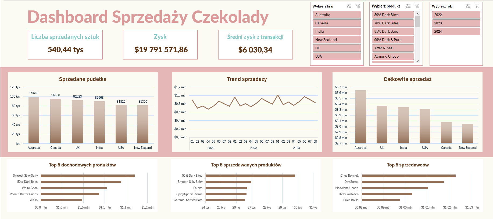

<h1>
📊Analiza Sprzedaży Czekolady
</h1>

## 🎯Wstęp

Powyższy dashboard przedstawia **analizę globalnej sprzedaży czekolady** w latach 2022 - 2024. Dane zostały pozyskane ze strony _[Kaggle.com](https://www.kaggle.com/)_.

> ℹ️ 
> Dane stworzone w celach edukacyjnych, nie odzwierciedlają rzeczywistych wyników sprzedaży.

Głównym założeniem projektu było przeprowadzenie **podstawowej analizy rynku**, skupienie się na kluczowych elementach tj. **trendy sprzedaży, kraje z największą sprzedażą, najlepiej sprzedawane produkty i najlepsi sprzedawcy**.

Produktem powyższych założeń jest interaktywny dashboard wykonany w **Excelu**.

## 📚Prezentowane umiejętności

- **Transformacja danych**: dane zostały sprawdzone pod kątem brakujących wartości oraz duplikatów - żadne z tych nie występowały, kolumny przedstawiające zysk oraz daty były łańcuchami znaków, więc zostały przekształcone na odpowiednie typy - walutowy oraz datę. Dodane zostały dodatkowe kolumny przedstawiające _dzień_, _miesiąc_ oraz _rok_ do późniejszej analizy.

- **Miary**: obliczone podstawowe miary jak suma zysków oraz sprzedaży i średni zysk z transakcji wykorzystując _tabele przestawne (Pivot Point)_.

- **Podstawowe wykresy**: wykorzystano wykresy kolumnowe, słupkowe oraz liniowe.

- **Interaktywność**: z pomocą narzędzia Pivot Point stworzone zostały fragmentatory, które pozwalają na filtrowaniu wyników ze względu na _kraj_, _produkt_ oraz _rok_.

## 💡Wnioski

- Największym kupcem czekolady jest Australia, od której odnotowuje się także największe zyski. Drugim z kolei państwem co do ilości sprzedaży jest Kanada, natomiast w zyskach Wielka Brytania, więc rynek Wielkiej Brytanii skupia się wokół droższych czekolad w przeciwieństwie do Kanady, która kupuje więcej, ale tańszych produktów.

- Z każdym rokiem sprzedaż czekolady wzrasta, podobnie jak zysk oraz średni zysk z jednej transakcji.

- Miesiącem z największym popytem każdego roku jest styczeń. Dane pokazują jedynie osiem pierwszych miesięcy każdego roku, nie jest jednak sprecyzowane czy w kolejnych miesiącach sprzedaż nie występuje czy dane na ten temat nie są udostępnione. Przyjmując założenie, że firma sprzedaje czekoladę jedynie w miesiącach styczeń - sierpień, można wywnioskować, że w styczniu następuje największy popyt ze względu na uzupełnianie magazynów po nowym roku, kontrakty rozliczne na początku roku, a także możliwość występowania noworocznych promocji i wyprzedaży.
   Drugim pikiem sprzedaży jest czerwiec, przyjmując powyższe założenia, można przypuszczać, że kraje robią zapasy na resztę roku, a także występują kolejne wyprzedaże.

- Najbardziej dochodowym produktem jest _Smooth Sliky Salty_, chociaż najczęściej kupowanym jest _50% Dark Bites_. Przyczyną tego jest wyższa cena _Smooth Sliky Salty_, jednak _50% Dark Bites_ pomimo niżej ceny może smakować o wiele większej grupie ludzi i być częściej używana do wypieków i jako inne dodatki.
   
   
   
  
